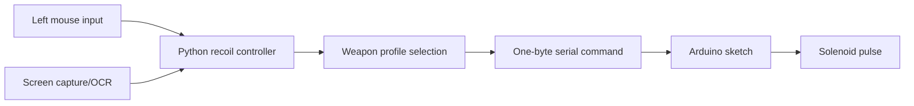

# Haptic Recoil Feedback Prototype

A work-in-progress haptic feedback system that translates mouse input and detected weapon profiles into timed solenoid pulses through an Arduino.

The goal is to prototype physical recoil feedback for games using a safe serial-command layer. The Python controller reads mouse input and optional screen OCR, selects a recoil profile, and sends simple one-byte commands to an Arduino sketch that controls solenoid pulse timing.

## Demo

[Watch the LinkedIn demo](https://www.linkedin.com/posts/kennedynguyen216_arduino-solenoid-computerscience-activity-7461477777280581632-5NQW?utm_source=share&utm_medium=member_desktop&rcm=ACoAAF8fJLQBrwnGUubY5rvjq77M4HRz8dQfgTA)

This repo is documented as a hardware prototype, and the demo shows the Arduino/solenoid feedback loop responding to the recoil controller.

## How It Works



**Highlights**

- Reads left-click input and sends serial recoil commands to an Arduino.
- Supports different recoil profiles for weapons such as Vandal, Phantom, Spectre, Operator, Sheriff, AK-47, AWP, and M4 variants.
- Can run in `--dry-run` mode for demos without hardware.
- Uses screen OCR as an experimental weapon-detection path.
- Keeps the hardware command protocol simple: one-byte commands mapped to pulse durations on the Arduino.

## Command Protocol

| Command | Example profile | Arduino behavior |
|---|---|---|
| `R` | Default recoil | Fires the default solenoid pulse. |
| `V` | Vandal / M4A4-style profile | Fires a shorter rifle pulse. |
| `P` | Phantom / M4A1-S-style profile | Fires a medium rifle pulse. |
| `S` | Spectre / SMG-style profile | Fires a short SMG pulse. |
| `H` | Sheriff / Deagle-style profile | Fires a heavier pistol pulse. |
| `O` | Operator / AWP-style profile | Fires a long sniper pulse. |

## What It Demonstrates

| Area | Evidence in this project |
|---|---|
| Hardware prototyping | Python sends serial commands to an Arduino-controlled solenoid. |
| Real-time input | Mouse input triggers hardware feedback while the app is running. |
| Computer vision/OCR | Optional screen capture and OCR detect the active weapon profile. |
| Safety boundaries | The controller reads pixels and mouse input only; it does not hook or inject into games. |

## Tech Stack

- Python
- Arduino / C++
- OpenCV
- PySerial
- MSS
- NumPy
- Pytesseract

## Setup

Create and activate a virtual environment:

```bash
python -m venv .venv
.venv\Scripts\activate
pip install -r requirements.txt
```

Upload `arduino_solenoid_recoil.ino` to the Arduino and update `SERIAL_PORT` in `recoil.py` if your Arduino is not on `COM3`.

## Running

Run the recoil feedback controller without hardware:

```bash
python recoil.py --dry-run --weapon Vandal
```

Run with Arduino hardware connected:

```bash
python recoil.py --weapon Vandal
```

## Prototype Status

This project is still evolving. Current limitations include hardware-specific serial ports, calibration-dependent OCR regions, and early-stage recoil profile tuning. Good next steps would be moving profile/config values into a separate config file and adding mocked tests around serial command generation.

## Safety and Ethics

This is designed as a hardware feedback experiment. The Python controller reads screen pixels and mouse input and sends simple serial commands to an Arduino; it does not read game memory, inject code, or hook game processes.
